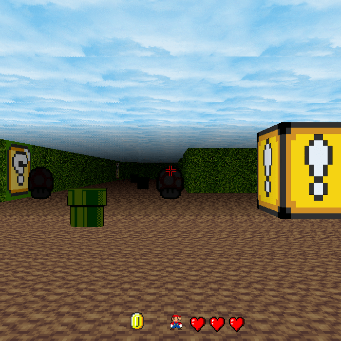

# 42Project cub3d<br>

이 프로젝트는 90년대 fps게임 울펜슈타인3D 에서 사용하는 __레이케스팅__ 기법을 이용합니다.<br>
This project uses the __raycasting__ technique used in the Wolfenstein 3D fps game of the 90s.<br>


# How to play?<br>
1. ```git clone https://github.com/ukjinlee66/42_cub3d.git```<br>
2. ```make```<br>
3. ```./cub3D```<br>
4. Enjoy the Game!<br>
5. To end the game, press the ESC button!<br><br>
KEY W,A,S,D are moving buttons and direction keys and mouse move adjust the viewing angle.<br>
Space key is jump and F key can open the door.<br>
Find Key and open secret Door!<br><br>
screenshot<br>
<br><br>
# Bonus list:<br><br>
- [x] Wall collisions.<br>
- [ ] A skybox.<br>
- [x] Floor and/or ceiling texture.<br>
- [x] An HUD.<br>
- [x] Ability to look up and down.<br>
- [x] Jump or crouch.<br>
- [x] A distance related shadow effect.<br>
- [x] Life bar.<br>
- [x] More items in the maze.<br>
- [x] Object collisions.<br>
- [x] Earning points and/or losing life by picking up objects/traps.
- [x] Doors which can open and close.<br>
- [x] Secret doors.<br>
- [ ] Animations of a gun shot or animated sprite.<br>
- [ ] Several levels.<br>
- [x] Sounds and music.<br>
- [x] Rotate the point of view with the mouse.<br>
- [ ] Weapons and bad guys to fight!<br>
# Reference sites<br><br>
- <https://github.com/taelee42/mlx_example> - mlx concept learning<br>
- <https://github.com/VBrazhnik/FdF/wiki/How-to-handle-mouse-buttons-and-key-presses%3F> - mlx x_event number (mouse,key)<br><br>
- <http://blog.naver.com/xxxstarxxx/221826768233> - rgb color decomposition process<br><br>
- <https://dojang.io/mod/page/view.php?id=702> - Bitmap file concept learned<br><br>
- <https://lodev.org/cgtutor/index.html> - raycasting Code Learning<br><br>
- <https://m.blog.naver.com/cory_kim/221117101364> - How to use SDL, add Music<br><br>
- <https://github.com/Glagan/42-cub3d> - other github projects<br>
- <https://github.com/rchallie/cub3D><br>
- <https://github.com/ilaystone/Cub3d>(include SDL)<br><br>
